# Halom Mermaid Diagrams

## Overview

This document contains Mermaid diagrams that visualize the architecture, interactions, and flows within the Halom ecosystem.

## System Architecture

### High-Level Architecture
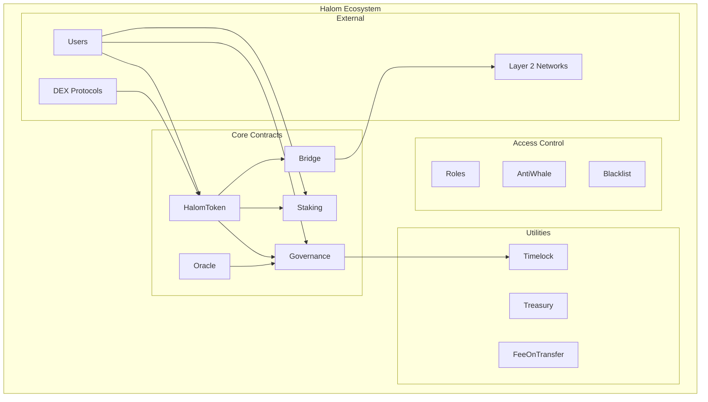
```mermaid
graph TB
    subgraph "Halom Ecosystem"
        subgraph "Core Contracts"
            Token[HalomToken]
            Governance[Governance]
            Staking[Staking]
            Oracle[Oracle]
            Bridge[Bridge]
        end
        
        subgraph "Access Control"
            Roles[Roles]
            AntiWhale[AntiWhale]
            Blacklist[Blacklist]
        end
        
        subgraph "Utilities"
            Treasury[Treasury]
            FeeOnTransfer[FeeOnTransfer]
            Timelock[Timelock]
        end
        
        subgraph "External"
            Users[Users]
            DEX[DEX Protocols]
            L2[Layer 2 Networks]
        end
    end
    
    Token --> Governance
    Token --> Staking
    Token --> Bridge
    Governance --> Timelock
    Oracle --> Governance
    Bridge --> L2
    Users --> Token
    Users --> Governance
    Users --> Staking
    DEX --> Token
```

### Contract Relationships
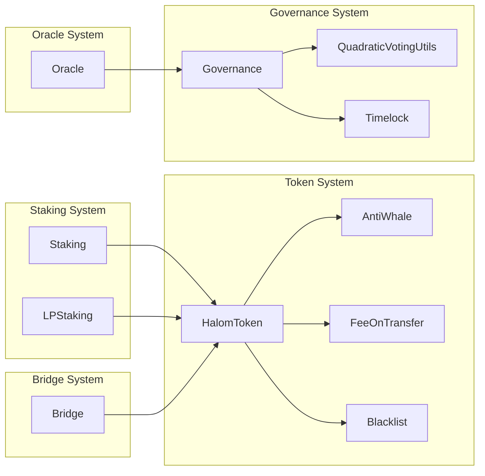
```mermaid
graph LR
    subgraph "Token System"
        HT[HalomToken]
        AW[AntiWhale]
        FT[FeeOnTransfer]
        BL[Blacklist]
    end
    
    subgraph "Governance System"
        GOV[Governance]
        QV[QuadraticVotingUtils]
        TL[Timelock]
    end
    
    subgraph "Staking System"
        STK[Staking]
        LPS[LPStaking]
    end
    
    subgraph "Oracle System"
        ORC[Oracle]
    end
    
    subgraph "Bridge System"
        BRG[Bridge]
    end
    
    HT --> AW
    HT --> FT
    HT --> BL
    GOV --> QV
    GOV --> TL
    STK --> HT
    LPS --> HT
    ORC --> GOV
    BRG --> HT
```

## Governance Flow

### Proposal Creation and Execution
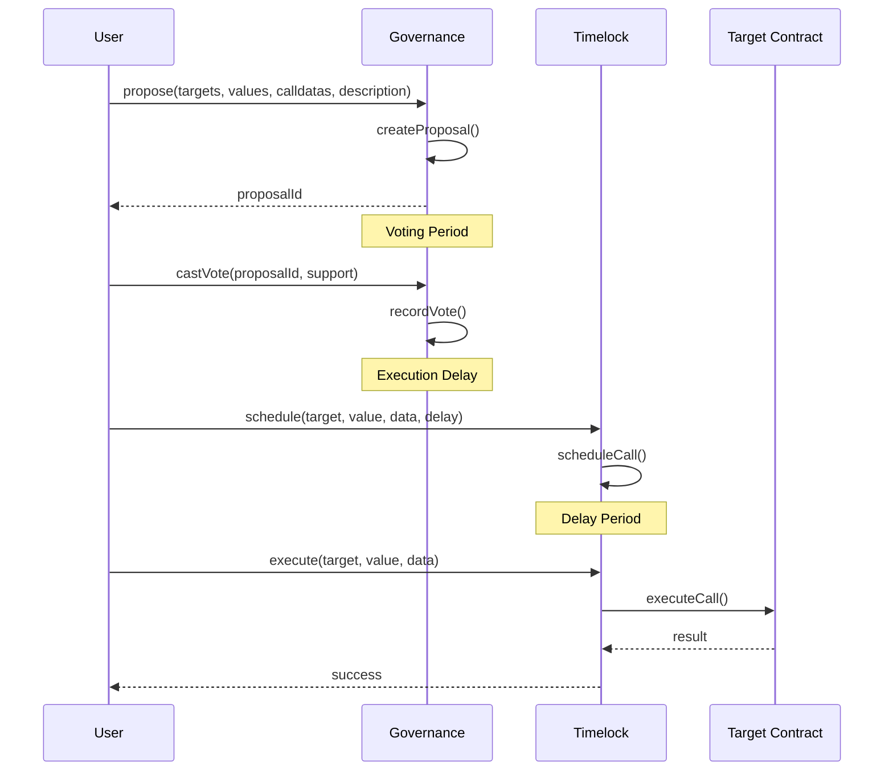
```mermaid
sequenceDiagram
    participant U as User
    participant G as Governance
    participant T as Timelock
    participant C as Target Contract
    
    U->>G: propose(targets, values, calldatas, description)
    G->>G: createProposal()
    G-->>U: proposalId
    
    Note over G: Voting Period
    U->>G: castVote(proposalId, support)
    G->>G: recordVote()
    
    Note over G: Execution Delay
    U->>T: schedule(target, value, data, delay)
    T->>T: scheduleCall()
    
    Note over T: Delay Period
    U->>T: execute(target, value, data)
    T->>C: executeCall()
    C-->>T: result
    T-->>U: success
```

### Quadratic Voting Mechanism
```mermaid
graph TD
    A[User Balance] --> B[Calculate Vote Power]
    B --> C[Vote Amount]
    C --> D[Quadratic Weight]
    D --> E[Total Vote Weight]
    
    A --> F[sqrt(balance)]
    F --> G[Vote Power]
    G --> H[Vote Cost]
    H --> I[Final Vote Weight]
    
    E --> J[Proposal Result]
    I --> J
```

## Staking Flow

### Token Staking Process
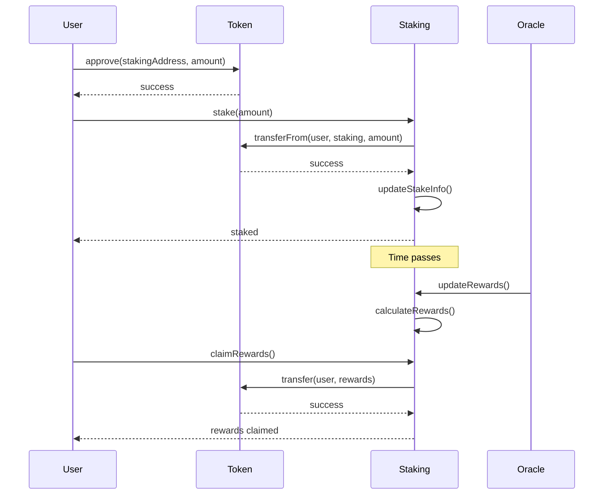
```mermaid
sequenceDiagram
    participant U as User
    participant T as Token
    participant S as Staking
    participant O as Oracle
    
    U->>T: approve(stakingAddress, amount)
    T-->>U: success
    
    U->>S: stake(amount)
    S->>T: transferFrom(user, staking, amount)
    T-->>S: success
    S->>S: updateStakeInfo()
    S-->>U: staked
    
    Note over S: Time passes
    O->>S: updateRewards()
    S->>S: calculateRewards()
    
    U->>S: claimRewards()
    S->>T: transfer(user, rewards)
    T-->>S: success
    S-->>U: rewards claimed
```

### LP Staking Flow
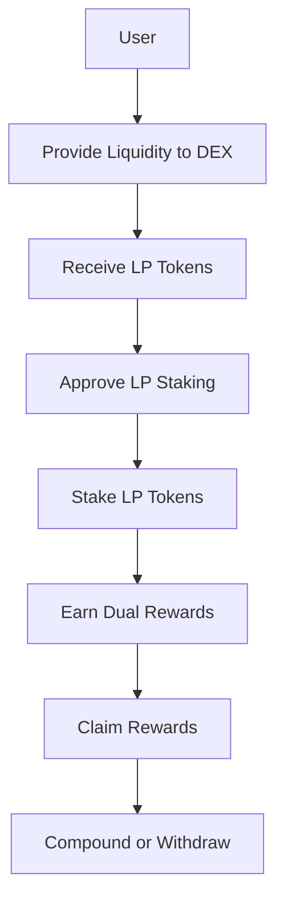
```mermaid
graph TD
    A[User] --> B[Provide Liquidity to DEX]
    B --> C[Receive LP Tokens]
    C --> D[Approve LP Staking]
    D --> E[Stake LP Tokens]
    E --> F[Earn Dual Rewards]
    F --> G[Claim Rewards]
    G --> H[Compound or Withdraw]
```

## Oracle Integration

### Data Flow
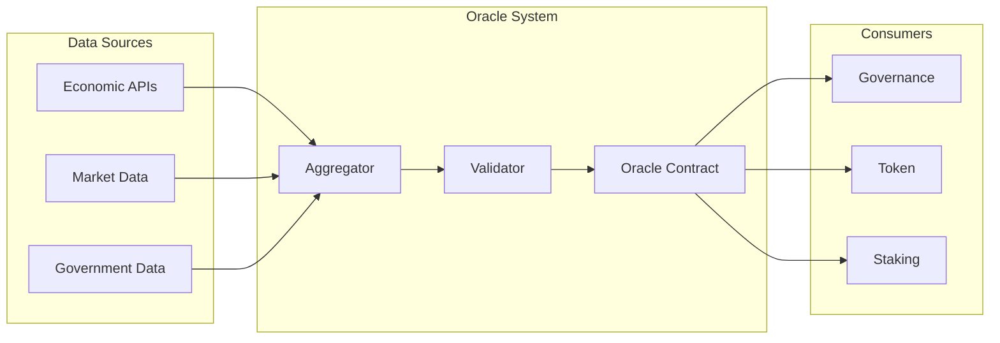
```mermaid
graph LR
    subgraph "Data Sources"
        API1[Economic APIs]
        API2[Market Data]
        API3[Government Data]
    end
    
    subgraph "Oracle System"
        O[Oracle Contract]
        A[Aggregator]
        V[Validator]
    end
    
    subgraph "Consumers"
        G[Governance]
        T[Token]
        S[Staking]
    end
    
    API1 --> A
    API2 --> A
    API3 --> A
    A --> V
    V --> O
    O --> G
    O --> T
    O --> S
```

### Oracle Update Process
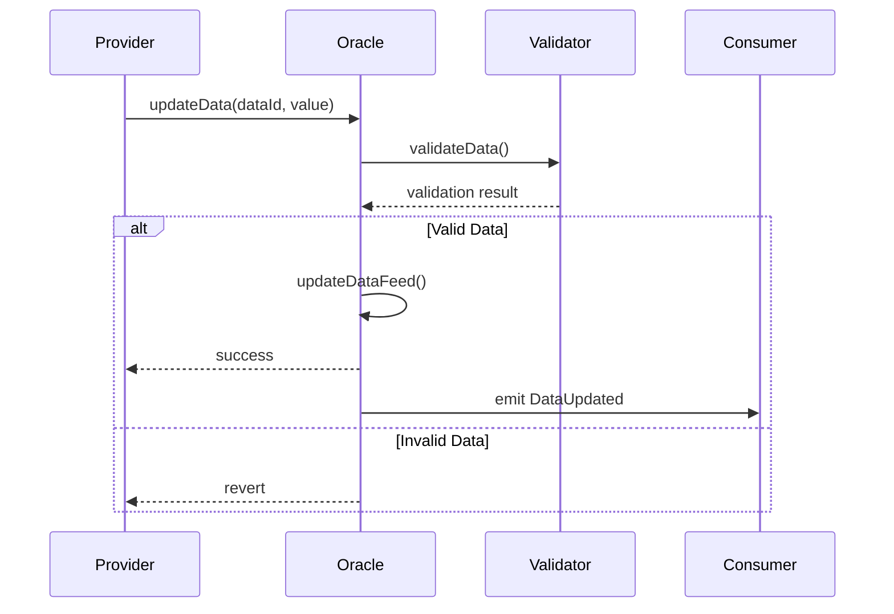
```mermaid
sequenceDiagram
    participant P as Provider
    participant O as Oracle
    participant V as Validator
    participant C as Consumer
    
    P->>O: updateData(dataId, value)
    O->>V: validateData()
    V-->>O: validation result
    
    alt Valid Data
        O->>O: updateDataFeed()
        O-->>P: success
        O->>C: emit DataUpdated
    else Invalid Data
        O-->>P: revert
    end
```

## Bridge Operations

### Cross-Chain Transfer
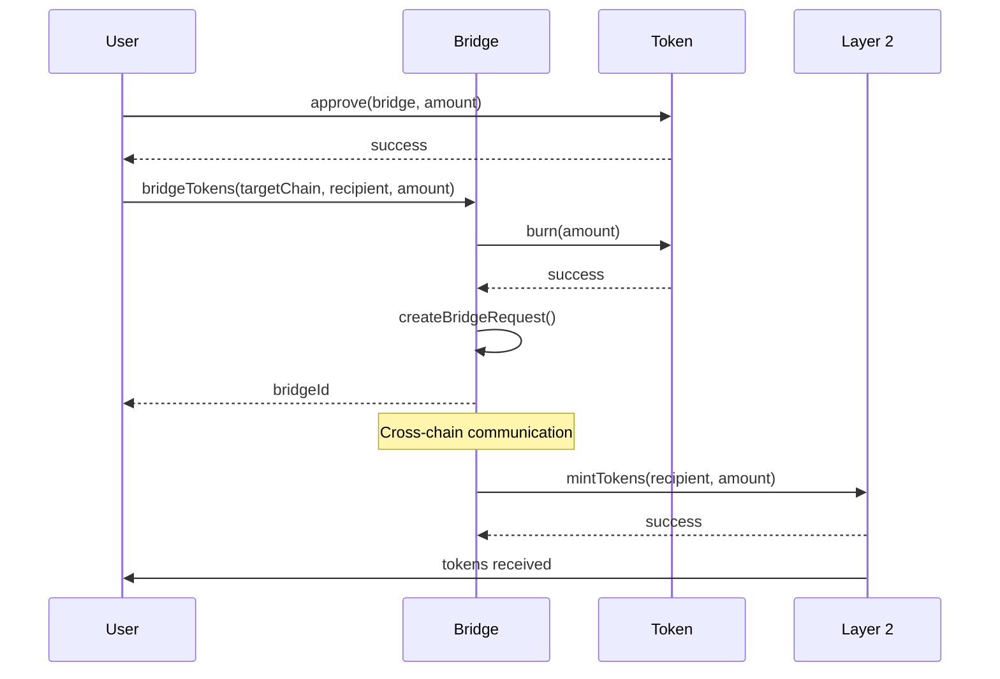
```mermaid
sequenceDiagram
    participant U as User
    participant B as Bridge
    participant T as Token
    participant L2 as Layer 2
    
    U->>T: approve(bridge, amount)
    T-->>U: success
    
    U->>B: bridgeTokens(targetChain, recipient, amount)
    B->>T: burn(amount)
    T-->>B: success
    B->>B: createBridgeRequest()
    B-->>U: bridgeId
    
    Note over B: Cross-chain communication
    B->>L2: mintTokens(recipient, amount)
    L2-->>B: success
    L2->>U: tokens received
```

## Emergency Response

### Emergency Flow
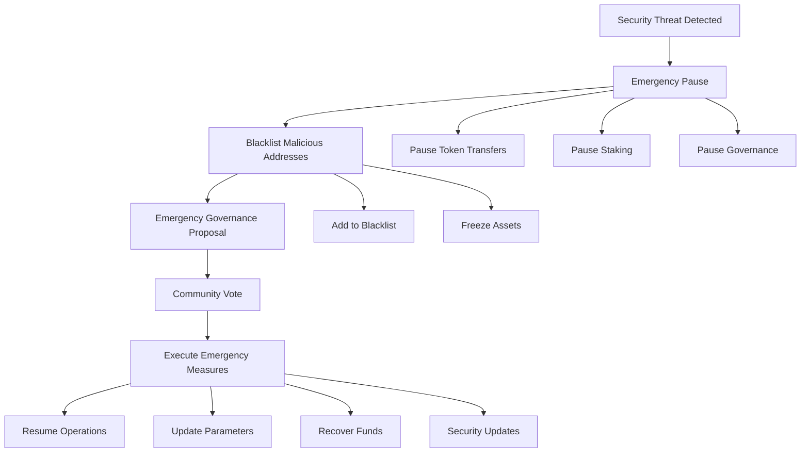
```mermaid
graph TD
    A[Security Threat Detected] --> B[Emergency Pause]
    B --> C[Blacklist Malicious Addresses]
    C --> D[Emergency Governance Proposal]
    D --> E[Community Vote]
    E --> F[Execute Emergency Measures]
    F --> G[Resume Operations]
    
    B --> H[Pause Token Transfers]
    B --> I[Pause Staking]
    B --> J[Pause Governance]
    
    C --> K[Add to Blacklist]
    C --> L[Freeze Assets]
    
    F --> M[Update Parameters]
    F --> N[Recover Funds]
    F --> O[Security Updates]
```

## Anti-Whale Protection

### Transfer Validation Flow
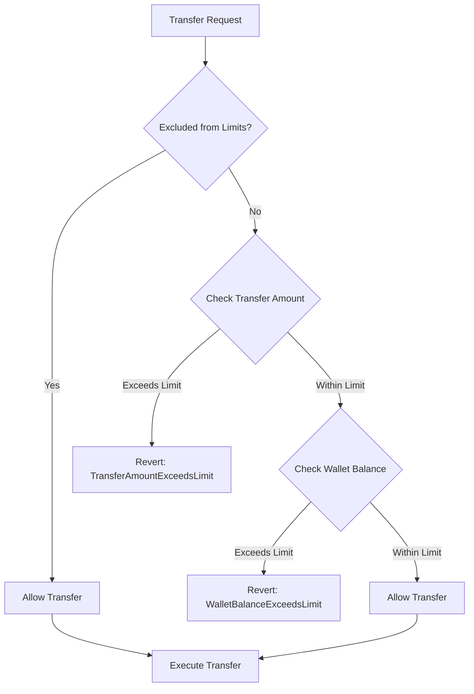
```mermaid
graph TD
    A[Transfer Request] --> B{Excluded from Limits?}
    B -->|Yes| C[Allow Transfer]
    B -->|No| D{Check Transfer Amount}
    D -->|Exceeds Limit| E[Revert: TransferAmountExceedsLimit]
    D -->|Within Limit| F{Check Wallet Balance}
    F -->|Exceeds Limit| G[Revert: WalletBalanceExceedsLimit]
    F -->|Within Limit| H[Allow Transfer]
    
    C --> I[Execute Transfer]
    H --> I
```

## Rebase Mechanics

### Rebase Process
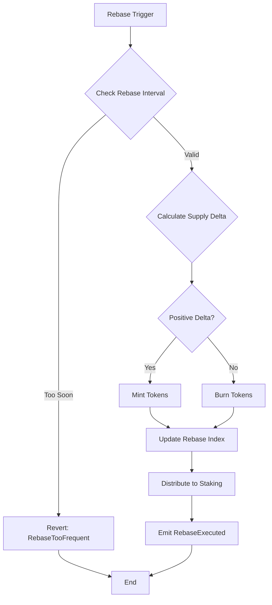
```mermaid
graph TD
    A[Rebase Trigger] --> B{Check Rebase Interval}
    B -->|Too Soon| C[Revert: RebaseTooFrequent]
    B -->|Valid| D{Calculate Supply Delta}
    D --> E{Positive Delta?}
    E -->|Yes| F[Mint Tokens]
    E -->|No| G[Burn Tokens]
    
    F --> H[Update Rebase Index]
    G --> H
    H --> I[Distribute to Staking]
    I --> J[Emit RebaseExecuted]
    
    C --> K[End]
    J --> K
```

## Role-Based Access Control

### Role Hierarchy
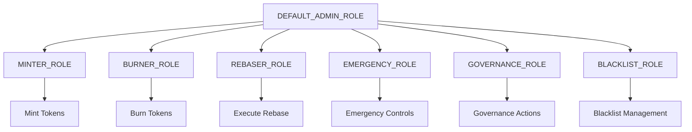
```mermaid
graph TD
    A[DEFAULT_ADMIN_ROLE] --> B[MINTER_ROLE]
    A --> C[BURNER_ROLE]
    A --> D[REBASER_ROLE]
    A --> E[EMERGENCY_ROLE]
    A --> F[GOVERNANCE_ROLE]
    A --> G[BLACKLIST_ROLE]
    
    B --> H[Mint Tokens]
    C --> I[Burn Tokens]
    D --> J[Execute Rebase]
    E --> K[Emergency Controls]
    F --> L[Governance Actions]
    G --> M[Blacklist Management]
```

## Integration Patterns

### DeFi Integration
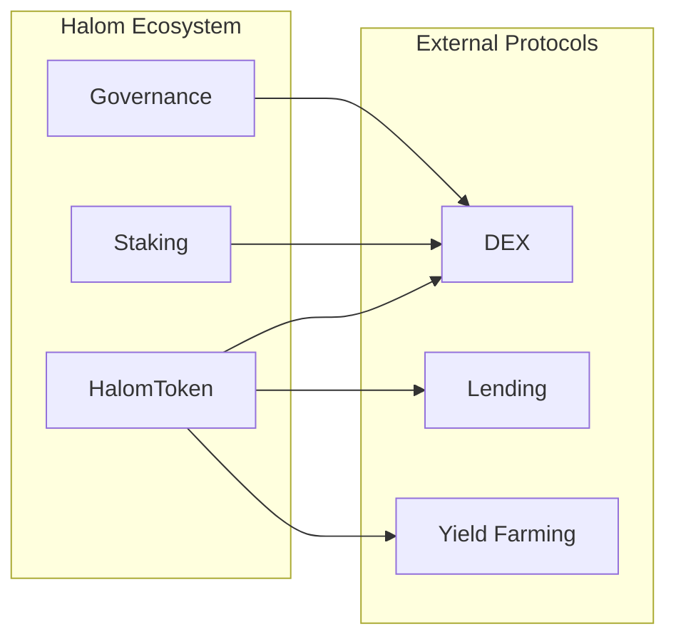
```mermaid
graph LR
    subgraph "Halom Ecosystem"
        HT[HalomToken]
        STK[Staking]
        GOV[Governance]
    end
    
    subgraph "External Protocols"
        DEX[DEX]
        LEND[Lending]
        FARM[Yield Farming]
    end
    
    HT --> DEX
    HT --> LEND
    HT --> FARM
    STK --> DEX
    GOV --> DEX
```

### Multi-Chain Architecture
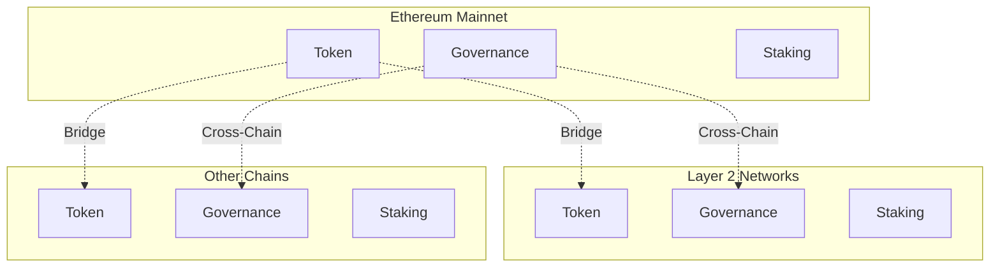
```mermaid
graph TB
    subgraph "Ethereum Mainnet"
        ETH_T[Token]
        ETH_G[Governance]
        ETH_S[Staking]
    end
    
    subgraph "Layer 2 Networks"
        L2_T[Token]
        L2_G[Governance]
        L2_S[Staking]
    end
    
    subgraph "Other Chains"
        CHAIN_T[Token]
        CHAIN_G[Governance]
        CHAIN_S[Staking]
    end
    
    ETH_T -.->|Bridge| L2_T
    ETH_T -.->|Bridge| CHAIN_T
    ETH_G -.->|Cross-Chain| L2_G
    ETH_G -.->|Cross-Chain| CHAIN_G
```

## State Management

### Contract State Transitions
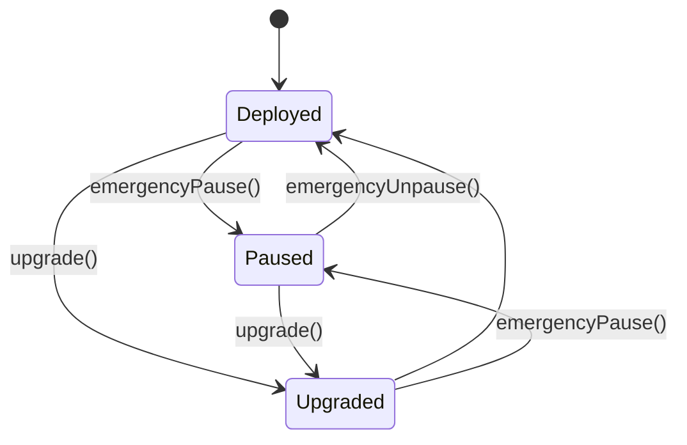
```mermaid
stateDiagram-v2
    [*] --> Deployed
    Deployed --> Paused: emergencyPause()
    Paused --> Deployed: emergencyUnpause()
    Deployed --> Upgraded: upgrade()
    Upgraded --> Deployed
    Paused --> Upgraded: upgrade()
    Upgraded --> Paused: emergencyPause()
```

### Governance State Machine
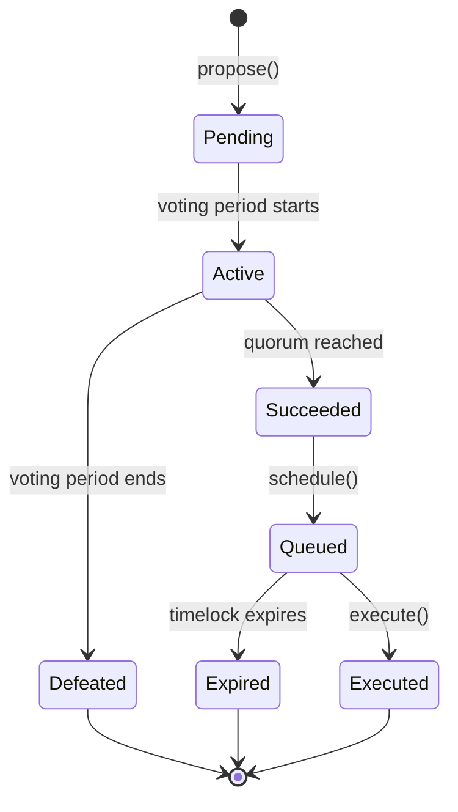
```mermaid
stateDiagram-v2
    [*] --> Pending: propose()
    Pending --> Active: voting period starts
    Active --> Succeeded: quorum reached
    Active --> Defeated: voting period ends
    Succeeded --> Queued: schedule()
    Queued --> Executed: execute()
    Queued --> Expired: timelock expires
    Defeated --> [*]
    Expired --> [*]
    Executed --> [*]
```

## Security Patterns

### Access Control Flow
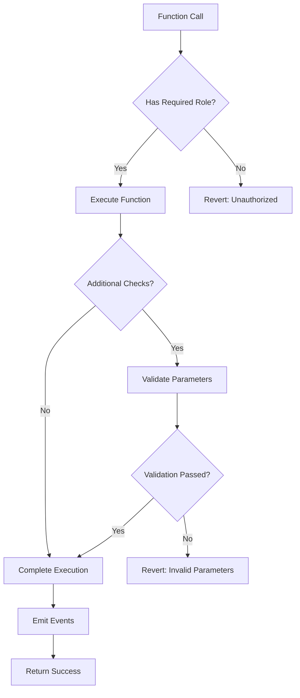
```mermaid
graph TD
    A[Function Call] --> B{Has Required Role?}
    B -->|Yes| C[Execute Function]
    B -->|No| D[Revert: Unauthorized]
    
    C --> E{Additional Checks?}
    E -->|Yes| F[Validate Parameters]
    E -->|No| G[Complete Execution]
    
    F --> H{Validation Passed?}
    H -->|Yes| G
    H -->|No| I[Revert: Invalid Parameters]
    
    G --> J[Emit Events]
    J --> K[Return Success]
```

### Emergency Response Chain
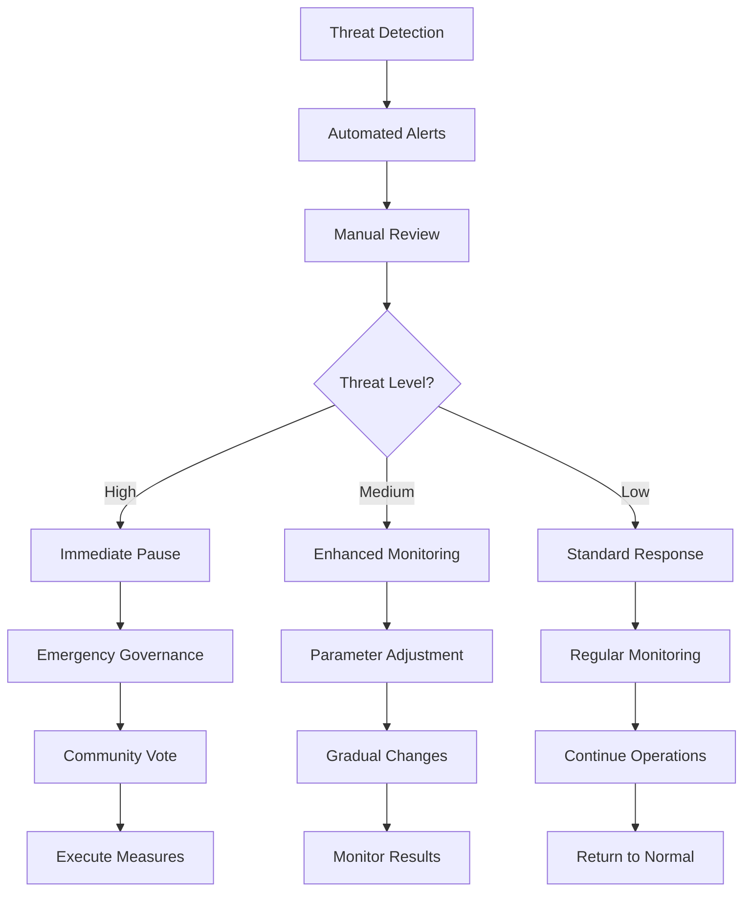
```mermaid
graph TD
    A[Threat Detection] --> B[Automated Alerts]
    B --> C[Manual Review]
    C --> D{Threat Level?}
    D -->|High| E[Immediate Pause]
    D -->|Medium| F[Enhanced Monitoring]
    D -->|Low| G[Standard Response]
    
    E --> H[Emergency Governance]
    F --> I[Parameter Adjustment]
    G --> J[Regular Monitoring]
    
    H --> K[Community Vote]
    I --> L[Gradual Changes]
    J --> M[Continue Operations]
    
    K --> N[Execute Measures]
    L --> O[Monitor Results]
    M --> P[Return to Normal]
``` 